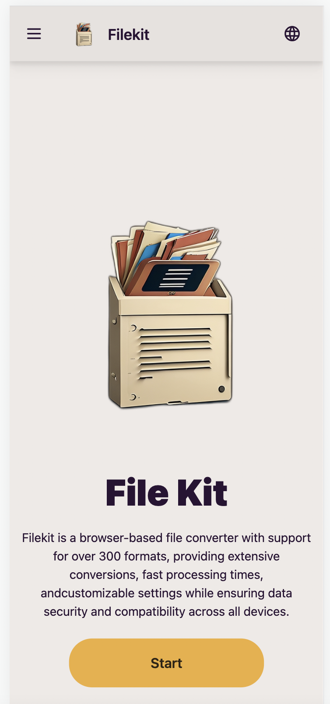

 # Welcome to wikitoday / filekit 👋 

<h3> Desktop </h3>

<table>
  <tr>
    <td></td>
    <td></td>
   <td></td>
  </tr>

</table>

<h3> Mobile </h3>

<table>
<tr>
    <td></td>
    <td></td>
</tr>
</table>

## 1. wikitoday.io
> Explore trending topics with wikitoday

- Web: https://wikitoday.io
- Frontend: https://github.com/filekit-co/wikitoday-front
- Back: https://github.com/filekit-co/wikitoday

"Wikitoday is an automated service that, leveraging OpenAI for content generation and DeepL for translation, crawls articles based on Google Trends for each country during peak news consumption hours. After regenerating the content, it translates it into languages of countries interested in that nation's news, pushes to GitHub, triggering a CI/CD process that deploys to the Wikitoday front-end server, and subsequently distributes the content across SNS and video platforms."

## 2. filekit.co
> Experience every type of file with FileKit

- Web: https://filekit.co
 
- Frontend: https://github.com/filekit-co/converto
- Backend
  - [Image background removal server](https://github.com/filekit-co/api-bg-remove)
  - [File handling api server](https://github.com/filekit-co/api-file/tree/main)

## 2. youtubetomp3.pages.dev

- Web: https://youtubetomp3.pages.dev
- Frontend: https://github.com/filekit-co/youTubetoMP3
- Backend:https://github.com/filekit-co/api-video