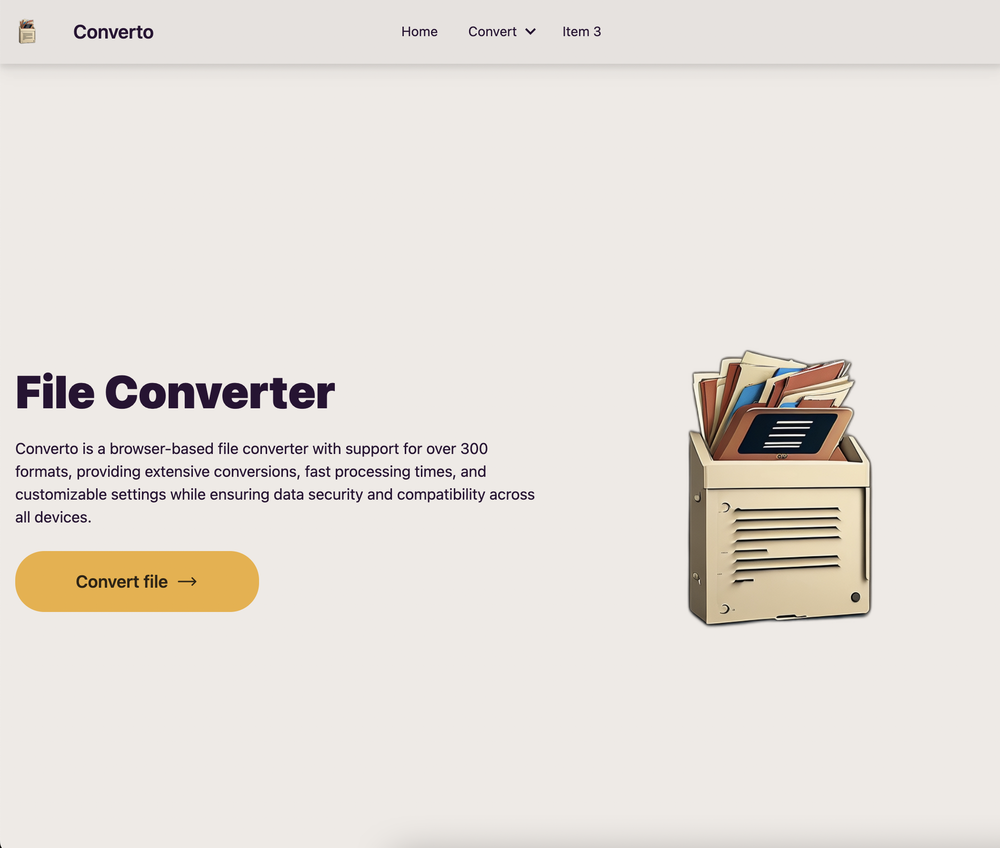

 # Welcome to `Wikitoday` 👋 

# 1. Wikitoday
> Explore trending topics with wikitoday

- Web: https://wikitoday.io
- Frontend: https://github.com/filekit-co/wikitoday-front
- Back: https://github.com/filekit-co/wikitoday

"Wikitoday is an automated service that, leveraging OpenAI for content generation and DeepL for translation, crawls articles based on Google Trends for each country during peak news consumption hours. After regenerating the content, it translates it into languages of countries interested in that nation's news, pushes to GitHub, triggering a CI/CD process that deploys to the Wikitoday front-end server, and subsequently distributes the content across SNS and video platforms."

<h3> Desktop </h3>

<table>
  <tr>
    <td></td>   
    <td></td>
   <td></td>
  </tr>

</table>

<h3> Mobile </h3>

<table>
<tr>
    <td></td>
    <td></td>
</tr>
</table>

# 2. Filekit
# `Filekit`
> Welcome to FileKit, the ultimate toolkit for file and media processing. Designed to simplify complex tasks, FileKit provides a suite of tools for file conversion, image processing, media downloads, and more. With a global reach and a commitment to performance, FileKit is the go-to solution for users worldwide.

- Websites:
    - https://filekit.co
    - https://youtubetomp3.pages.dev
- Source codes:
    - [Filekit-front](https://github.com/filekit-co/converto)
    - [Youtube-to-mp3-front](https://github.com/filekit-co/youTubetoMP3)
    - [Image Server](https://github.com/filekit-co/api-bg-remove/tree/main)
    - [Text Server](https://github.com/filekit-co/api-text/tree/main)
    - [Video Server](https://github.com/filekit-co/api-video/tree/main)
- Swagger:
    1. [Video API Server](https://api-video-xgnu4lf2ea-uc.a.run.app/docs)
    2. [Image API Server](https://api-bg-remove-xgnu4lf2ea-de.a.run.app/docs)
    3. [Text API Server](https://api-file-xgnu4lf2ea-de.a.run.app/docs)

## Stack

- Design: Tailwind css
- Framework: Svelte / Sveltekit
- Deploy: Vite / Cloudflare pages

## 🌍 Global Engagement

FileKit's commitment to international users is evident in its extensive localization, supporting **36 languages**. Our platform has seen engagement from users spanning continents, from the bustling streets of India to the serene landscapes of Norway.

just a month 23.07 ~ 23.08, we've had:

- Over 1,200 active users from **Türkiye**.
- A remarkable engagement rate of 72% from **Ukraine**.
- An average session time of over 262 minutes from users in **South Korea**.
- Active users from diverse regions like **Uzbekistan**, **Kazakhstan**, **India**, and the **United States**.

These metrics are a testament to FileKit's universal appeal and its ability to cater to diverse user needs.

<table>
  <tr>
    <td></td>
    <td></td>
  </tr>
  <tr>
    <td></td>
  </tr>
</table>

## 🚀 Features

### 📄 Document Conversion
Effortlessly convert between popular document formats like PDF, DOC, DOCX, and more.

### 🎥 Media Processing
Download and convert media from platforms like YouTube and TikTok.

### 🎨 Image Manipulation
From background removal to format conversion, FileKit's image tools have you covered.

### 😊 Emoji & Icon Library
Discover and utilize a vast collection of emojis and icons for your projects.

## 🛠️ Technical Highlights

- **SvelteKit**: Experience lightning-fast performance with SvelteKit's server-side rendering (SSR).
- **SEO Optimized**: With meticulously crafted meta data, FileKit ensures optimal search engine visibility.
- **i18n**: Our platform speaks your language, with support for 36 languages ensuring a seamless user experience.

## Pages

#### Mobile pages

<table>
  <tr>
    <td></td>
    <td></td>
        <td></td>
    <td></td>
  </tr>
</table>

#### Desktop pages

<table>
  <tr>
    <td></td>
    <td></td>
  </tr>
  <tr>
    <td></td>
    <td></td>
  </tr>
  <tr>
    <td></td>
    <td></td>
  </tr>
  <tr>
    <td></td>
    <td></td>
  </tr>
</table>

# 3. Jarvis

## Overview
Jarvis is a cutting-edge platform that integrates ChatGPT with domain-specific knowledge. By vectorizing vast amounts of domain knowledge, Jarvis allows users to utilize GPT in context with domain-specific information. Furthermore, with the power of fine-tuning, Jarvis offers a more customized GPT experience tailored to the specific needs of its users.

## Stack
- Domain Knowledge Utilization: `Langchain` / `Openai`
- Vectorestore / Database: `Redis`
- WSS server / API server: `Fastapi` / `Nginx`
- For Report: [Report Jupyter Notebook Repo](https://github.com/minkj1992/jupyter-notebook-docker-compose/tree/main)

## Features
1. **Domain Knowledge Integration**: Jarvis transforms extensive domain knowledge into vectorstore, enabling GPT to operate within a specific domain context.
2. **Customizable GPT**: Through fine-tuning, users can have a GPT experience that is more aligned with their specific requirements.
3. **Chatbot Service**: Designed with use-cases such as onboarding part-time staff for solo entrepreneurs and facilitating conversations with book authors.
4. **Report Generation**: Using the user's chat conversation history as input, Jarvis allows users to select a topic of interest. It then provides an in-depth report, analyzing the topic across 3-4 subtopics.

## Services

1. **Chatbot**: Ideal for scenarios like assisting self-employed individuals in onboarding part-time workers or enabling conversations with book authors.

2. **Report Writing**: Users can input their existing chat conversation history, and upon selecting a desired topic, Jarvis will generate a comprehensive report, breaking down the topic into 3-4 detailed subtopics.

<h4>1. Swagger</h4>
<table width="100%" border="0">
  <tr>
    <td></td>
    <td></td>
  </tr>
</table>

<h4>2. Vectorstore redis</h4>
<table width="100%" border="0">
  <tr>
    <td></td>
    <td></td>
  </tr>
</table>

<h4>3. Use case</h4>
<table width="100%" border="0">
  <tr>
    <td></td>
    <td></td>
    <td></td>
  </tr>
</table>

